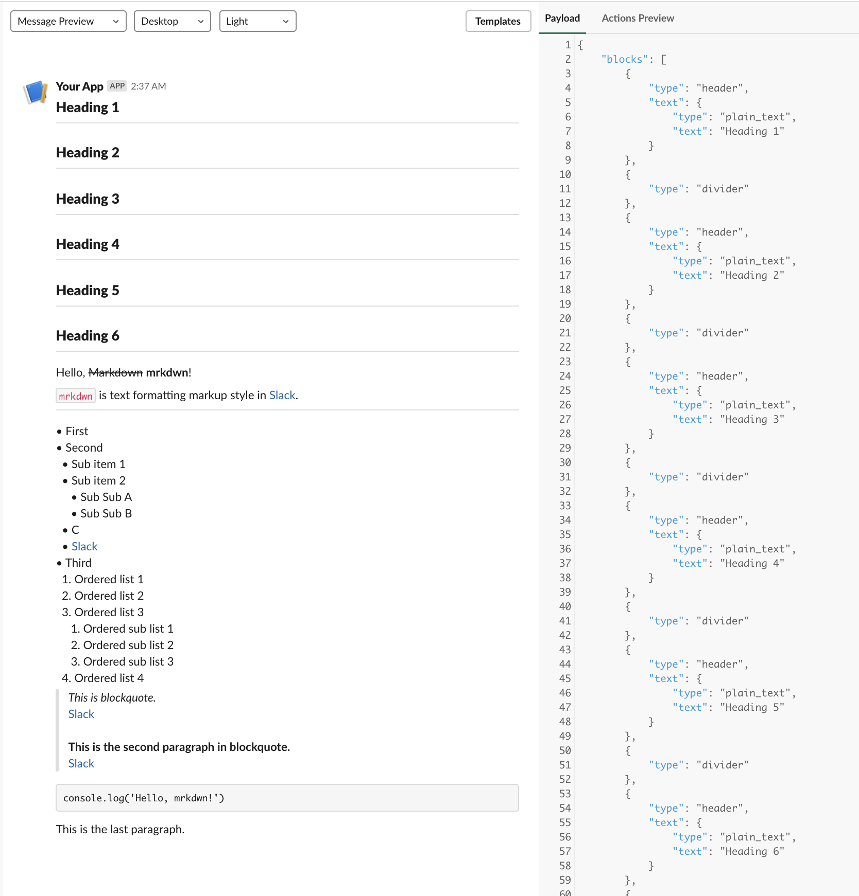

# blackfriday-slack-block-kit

A [blackfriday v2](https://github.com/russross/blackfriday/tree/v2) AST renderer for [Slack Block Kit](https://api.slack.com/block-kit).

## Command-Line Usage

Let's render [the full example](blockkit/_testdata/full_example.md) into Block Kit UI Layout via the command-line tool:
```
# checkout this repository then
go build
cat blockkit/_testdata/full_example.md | ./blackfriday-slack-block-kit
```

You can check how it will look in the Slack at https://app.slack.com/block-kit-builder/ with the generated JSON.



## Library Usage

Please have a look at [main.go](main.go).

## Releases

https://github.com/nabeken/blackfriday-slack-block-kit/releases

## Thanks

`blackfriday-slack-block-kit` is derived from https://github.com/karriereat/blackfriday-slack

## License

See [LICENSE](LICENSE)
